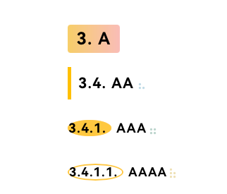
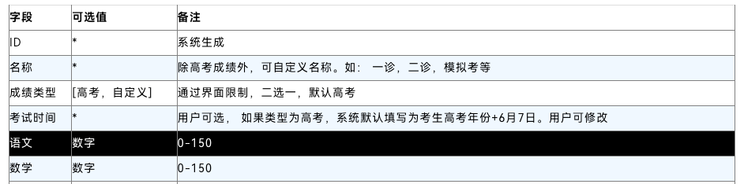

感谢作者的分享！

由于个人在base.user.css增加了标题的自动编号，与该主题不匹配。按照个人喜好进行了修改...

PS: 该主题在Mac下适配良好

- Fix: H4、H5 使用before伪元素后，与生成编号的伪元素冲突，导致样式异常

- Style: 增加了表格的边框和Hover效果

---
>此主题仅在Windows下设计和测试，在其他操作系统上的效果未知！
# 物理猫Phycat

## 主题说明

此主题是我制作用于生成网页课件的Typora主题，橙黄色主色调，简约美观。比较适合Markdown导出为带有样式的HTML文件进行分享

具有以下特点：
1. 优化大纲标题显示样式，层级分明，直观漂亮；
2. 部分标题增加了hover动画，鼠标移动上去有简单的互动；
3. 表格样式进行了调整，更加简约，代码块使用了亮色的Mac风格，很漂亮；
4. 超链接前面会加一个可爱的小图标。
5. 使用Typora导出网页，大纲目录的样式也进行了同样的优化

## 主题预览

### Markdown样式

### 侧边栏大纲

### 导出HTML样式

## 安装使用

打开Typora➡️文件➡️偏好设置➡️外观➡️打开主题文件夹➡️解压压缩包，将文件夹中的内容（phycat文件夹、phycat.css文件、phycat.user.css文件）移动至此目录（themes文件夹下）➡️重启Typora➡️选择主题➡️开始使用

## 更新日志

### 2024-05-13
简化修改了列表的CSS样式，使其更加简约直观。为标题添加了after，便于快速分别是几级标题。去除了二级标题的inline-block样式，使用width:fit-content，使其宽度自适应，避免之前issue提到的bug。
### 2024-03-29
修改了行内代码CSS样式，使其更醒目
### 2024-03-16
优化Markdown的目录样式
### 2024-03-04
修复打印页面的时候，出现不正常的内容截断
### 2024-01-19
修复无序列表二级列表的显示
### 2024-01-29
修复代码块显示异常
### 2024-01-18
增加了任务列表的样式，对打印出来的页面进行了大小和行间距的设置。

